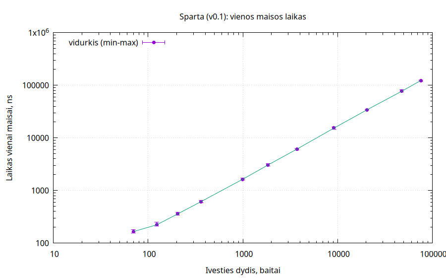
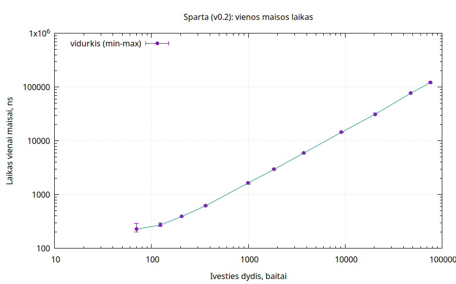
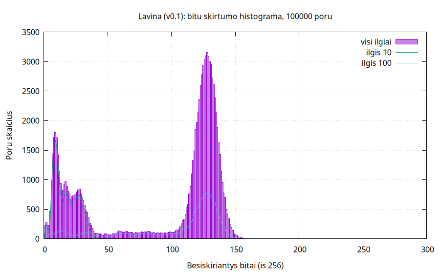
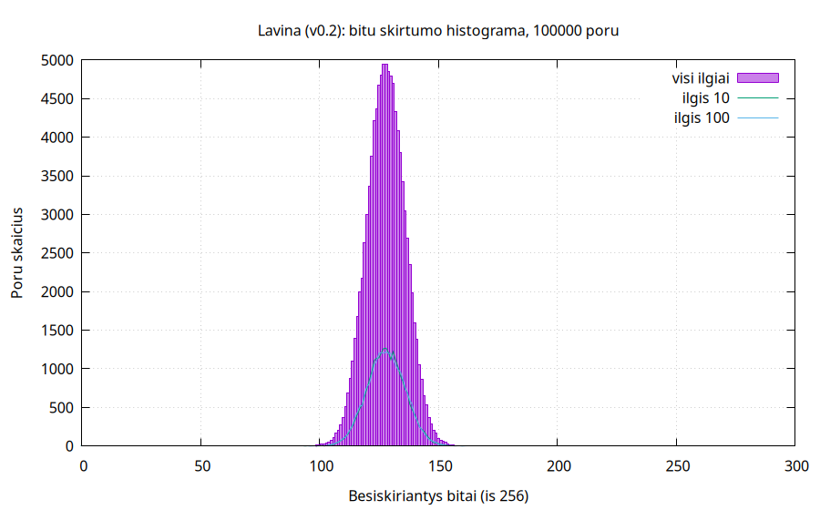

# Blok-Grandini-praktinis
## `muhhash` – mokomasis 256 bitų maišos generatorius (supaprastinta kopija)

**Mokomasis algoritmas.** Testai ir nerastos kolizijos *neįrodo* kriptografinio saugumo (atsparumo pirmavaizdžio, antrojo pirmavaizdžio ar kolizijų atakoms). Slaptažodžiams – Argon2id (RFC 9106). SHA-256 / MD5 / SHA-1 nenaudojami.

`simplified/` – savarankiška kopija (kodas, `data/`, `results/`, `plots/`, `scripts/`, `tests/`, `konstitucija.txt`). Skaičiai – iš `results/**`, eigos log – `run_all.log`.

- **v0.1** – be DI, originalas `git tag v0.1`. Kopija `versions/v0_1/muhhash_v0_1.cpp` skiriasi tik tuo, kad `rotl` – be neigiamo poslinkio (H5).
- **v0.2** – su DI (Claude Code, Sonnet 5.5): `muhhash.cpp`, `hashBytes` = `hashRounds(data, 4)`.

## Kompiliavimas ir paleidimas

```
cmake -S . -B build && cmake --build build # (iš simplified/) C++17, Release, -O2 (flags: -O2 -std=gnu++17)
make

```

Išvedama `Rezimas: failas|tekstas` ir `Baitu: N`. Išeities kodai: 0 – gerai; 1 – nėra įprasto failo, katalogas ar ne UTF-8 tekstas; 2 – nežinomas `--algo`. Patikrinta (`ctest` 3/3, visi režimai ir klaidų atvejai).

Eksperimentai: `build/experiments <inputs|format|determinism|speed|collisions|avalanche|guess|rotations> [--algo ...] [--data data] [--out results]` (numatyta `--algo v0.1`).

## Įvestis ir išvestis

- **Failas:** visi baitai vienu skaitymu, laikomas atmintyje (tai ir praktinė dydžio riba).
- **Tekstas (`--text`, meniu 1):** viena UTF-8 eilutė be normalizavimo. `getline` galinio `\n` neįtraukia, `\r` lieka (`printf 'abc\r\n'` → 4 baitai). Netinkamas UTF-8 – klaida.
- **Išvestis:** 64 mažosios hex raidės su pradiniais nuliais (`format.csv`: 38/38 abiem versijomis).
- v0.1 `int` perpildymas nuo n = 268 435 457 B (H5) čia nesukelia UB – abi versijos poslinkį redukuoja į 0..31.
- Windows konsolės UTF-8 režimas nerealizuotas (aplinka – Linux).

## Algoritmas

8 juostos `s[0..7]` po 32 bitus, `n` – ilgis baitais, `MUL = 0x9E3779B1`, `ROT = {5, 9, 13, 17, 21, 25, 29, 3}`,
`IV = 1A2B3C4D 5E6F7081 92A3B4C5 D6E7F809 1B2C3D4E 5F607182 93A4B5C6 D7E8F90A`.

**v0.1**
```
s = IV
for i in 0..n-1: # j = i mod 8
    r = (j+1)*n - j + ROT[j] # int; rotl naudoja ((r mod 32) + 32) mod 32
    s[j] += data[i];  s[j] = rotl(s[j], r);  s[j] ^= s[(j+3) mod 8];  s[j] *= MUL
išvestis = s[0..7], kiekviena big-endian
```

**v0.2** (tas pats ciklas, `r` be ženklo, plius ilgis ir finalizavimas)
```
s = IV
for i in 0..n-1: # j = i mod 8
    r = ((j+1)*n - j + ROT[j]) mod 32 # uint64, be perpildymo
    s[j] += data[i];  s[j] = rotl(s[j], r);  s[j] ^= s[(j+3) mod 8];  s[j] *= MUL
s[0] += n mod 2^32;  s[1] += n >> 32 # 64 bitų ilgis
kartoti R = 4 kartus:
    for j in 0..7:
        s[j] += s[(j+1) mod 8];  s[j] = rotl(s[j], ROT[j]);  s[j] ^= s[(j+5) mod 8];  s[j] *= MUL
išvestis = s[0..7], kiekviena big-endian
```

## Aplinka ir atkūrimas

- Linux, g++ 16.2.0, CMake 4.4.3, i5 (16 gijų), gnuplot 6.0 pl. 5
- `std::mt19937_64`, `SEED = 20240929` (`experiments/common.h`); eksperimentas k naudoja `SEED + k`. Intervalai – savas atmetimo metodas (`Rng::below`). Įvestys abiem versijoms tos pačios, išskyrus `format_zeros`. Rezultatai tik su vienu seed.
- Abėcėlė – ASCII `0x21–0x7E` (94 simboliai), išskyrus bito apvertimą, rinkinius `all_*`, `last_k_bytes_differ`, `x_vs_x_NUL` ir druskas.

```
scripts/run_all.sh v0.1 v0.2 v0.2-r1 v0.2-r2 v0.2-r4 v0.2-r8 # build + ctest + visi eksperimentai -> results/<versija>/*.csv (+ cli_check.txt)
scripts/plots.sh v0.1; scripts/plots.sh v0.2 # gnuplot -> plots/<versija>/*.png
scripts/rounds_table.sh # results/v0_2/rounds_table.csv (reikia v0.2-rN rezultatų)
scripts/h5_h6_evidence.sh # results/v0_1/h5_h6.txt (reikia git repozitorijos su tag'u v0.1 ir UBSan)
```
`run_all.sh` be argumentų vykdo tik v0.1; `data/` sugeneruoja `build/experiments inputs`.

## Eksperimentų rezultatai

Pilni duomenys – `results/v0_1/`, `results/v0_2/` (CSV naudoja dešimtainį tašką).

### 1. Įvestys

38 failai `data/` (čia 21, visi – `inputs.csv`): tuščias, `a`, `b`, atsitiktiniai 1500 / 10 000 / 50 000 B ir jų kopijos su pakeistu baitu, `aaa…` įvairių ilgių, permutacijos, tarpai, `\n`/`\r\n`, registras, lietuviškos raidės, emoji.

| Failas | Simboliai | Baitai | v0.1 maiša | v0.2 maiša |
|---|---|---|---|---|
| `empty.txt` | 0 | 0 | `1a2b3c4d5e6f708192a3b4c5d6e7f8091b2c3d4e5f60718293a4b5c6d7e8f90a` | `b04f9d7088734b417521fa65f36e245a5985adbcf5152ab9bbc9708e7c499716` |
| `a.txt` | 1 | 1 | `b9f1dcdf5e6f708192a3b4c5d6e7f8091b2c3d4e5f60718293a4b5c6d7e8f90a` | `ae91a3bb374f40cdcd3e027b1956050dd49b5efd5f9e9da6b4a88609e754b882` |
| `b.txt` | 1 | 1 | `47d0491f5e6f708192a3b4c5d6e7f8091b2c3d4e5f60718293a4b5c6d7e8f90a` | `7908849aa88019d692476746df168323192fef7d3faab726dfdbdd30a333ab49` |
| `rand1.txt` | 1500 | 1500 | `e7716aed0ed2bb96d6f2ac54fe57781c4ee96c1dff702cbcf070fd9cbdd36e78` | `aa08bfc4726be889611d4e4c579adaea22fd279c737b6bcfe0003a95bb71d3e8` |
| `rand1_first.txt` | 1500 | 1500 | `bde36a862e72c0461c68fb7f490db9b950a145596cf3338ebda5f8726b529dbd` | `54f52053a545d20b2b0495ff4f5079caab17c18c15d79f98b48b3bf96f9cd9a6` |
| `rand1_mid.txt` | 1500 | 1500 | `c6ab91b080db6b98336ce82970958c0a750cddfd278361edc3073a8a7e2a9f27` | `e886d13a8201bdea3a2c416d8d1451c33b84ee6657f9b976d19e104be2031929` |
| `rand1_last.txt` | 1500 | 1500 | `e7716aed0ed2bb96d6f2ac5403fd5fb34ee96c1dff702cbcf070fd9cbdd36e78` | `4319a1c32638aa9f19f5aaeaf44b21abb6a51136218ebcc656edfcd11ccf6e7c` |
| `rep_a_7.txt` | 7 | 7 | `530d923b4bd72cf243887964a0fd5f8d597e66f9b24a0753b050b711d7e8f90a` | `065e8609a8f7f69162908d5e93aff0ae292dad06ac5ff13f29dbdb3894a4ddfd` |
| `rep_a_8.txt` | 8 | 8 | `5355eb8c703c2ade5f8adbd62be35ecffa8308217d3f55e9ae00a74c00808040` | `7552a247e040697aaf3f1fc7722c3f3c3e57f9966054baaf459a5b5d52acf94a` |
| `perm_abc.txt` | 3 | 3 | `686a7e2372380a45cd71dbe9d6e7f8091b2c3d4e5f60718293a4b5c6d7e8f90a` | `b0c016e09387471998e6796e8a1519f8cdcfc2eac8723f83a104b96a9964bd7e` |
| `perm_acb.txt` | 3 | 3 | `686a7e2350a44a45eda1dbe9d6e7f8091b2c3d4e5f60718293a4b5c6d7e8f90a` | `e32039305656dbe32955c606610aa983ea1106213703e61009e7e0e55c60a81a` |
| `space_lead.txt` | 8 | 8 | `75040b8c3d3c2adeed694816a5945ecfa4830821398a31298e2b274c7a3c6f80` | `92fe832f833dde5fe9ff94abe2cbb64a3e2dfeb790a25084f7e9125684eb22a0` |
| `space_trail.txt` | 8 | 8 | `f2c68b8ce83c2ade267a11f65a151ecf4283082124be9b39b600a74c0c8ac724` | `db482bb92bb149064c2cc4ed7856701536d7fb4c59b64d3b0e9f83e29b06204a` |
| `lt_nonl.txt` | 7 | 7 | `22c5e23be9d72cf2bc6660286e1a438d3c3e66f91dbe6ab5ae50b711d7e8f90a` | `05feb4c268c4ee6ceba6356a72b2d5021ebc5d5b512d5503fd2d4d260193753f` |
| `lt_nl.txt` | 8 | 8 | `f2c68b8ce83c2ade267a11f65a151ecf4283082124be9b39b600a74cc7313437` | `0245bbc47a50abc5ab8e781a1e3074754b61a3d846dfce99a094e5b1ce75a05e` |
| `crlf.txt` | 5 | 5 | `26f65c11cb4c87034ce43076c738668d31e245865f60718293a4b5c6d7e8f90a` | `1d58d0ef1d8a365e0c2be646ebeff45a3c1789ecdb734a88ef6b2d8a02dd4a48` |
| `lf.txt` | 4 | 4 | `d86b632d3a5522d12aa0f4d875be13221b2c3d4e5f60718293a4b5c6d7e8f90a` | `8b2f2f4e06b392907c04b8f7dbd6f279e6b0d89855244a2086f6379e0d8cd86a` |
| `lt_lower.txt` | 7 | 7 | `2f63e23be9d72cf2bc6660286e1a438d3c3e66f94bfc6ab5ae50b711d7e8f90a` | `ab79bd843250d3f3710c1f709f5a2ce1715760a3c5b403d6e53f210a3913a3b1` |
| `lt_cap_excl.txt` | 8 | 8 | `f2c68b8ce83c2ade267a11f65a151ecf4283082124be9b39b600a74c1c8ac724` | `f22ae7a9c32d4d4abd7b751a43f7aa4ac90913c317bf3e1374242eb0f34fbc0c` |
| `lt_diacritics.txt` | 9 | 18 | `43fa9d0dc8317d23e776b0b006c4e964b87e62d67f9990959642385a067ac706` | `c05ef282e6e52476a3e20f693f1ad147a9498dad2aa30bd16a7f713e2ff5a4be` |
| `emoji.txt` | 2 | 8 | `7dfa0b8cb073a48f865db50e28701ecf93986896d09213c99f59124dd27de167` | `4353f03aa748275875b8feea40440e3a7cc411c1588f67926e2eb898dcc2c144` |

### 2. Formatas ir determinizmas

Visos 38 maišos – 64 simboliai `[0-9a-f]`. Pirma maiša su pradiniais nuliais (atsitiktinės 10 simbolių eilutės, riba 5 000 000; `format_zeros.csv`):

| Pradžia | v0.1 bandymai | v0.1 įvestis | v0.2 bandymai | v0.2 įvestis |
|---|---|---|---|---|
| `0` | 13 | `bg$XknO-&l` | 7 | `H"OH#"f~^4` |
| `00` | 29 | `<'s;:I[&f7` | 333 | `}c+E[BP=@#` |
| `000` | 2559 | `+PbFc+M_^3` | 6737 | `3F\@X]tEJ{` |

| Teisingumo testas (38 įvestys) | v0.1 | v0.2 |
|---|---|---|
| 64 hex simboliai `[0-9a-f]` | 38/38 | 38/38 |
| `--text` = failas, kai baitai vienodi (`Lietuva` ↔ `lt_nonl.txt`) | sutampa | sutampa |
| 5 kvietimai, seka A, B, A, 3 atskiri paleidimai – neatitikimų | 0 | 0 |

`lt_nl.txt` (su `\n`) duoda kitą maišą nei tekstas `Lietuva` (`cli_check.txt`, `determinism.csv`).

### 3. Sparta (`speed.csv`, pradiniai matavimai – `speed_raw.csv`)

`steady_clock`, ns vienai maišai; pirmos 1, 2, 4 … 512 eilučių iš `konstitucija.txt` ir visas failas (789 eil.). 20 apšilimo kvietimų, 10 matavimų dydžiui (kiekvienas – ≥ ~5 ms kvietimų grupė); duomenys iš anksto atmintyje, rezultatas XOR'inamas į `volatile`, std – imties. Versijos matuotos paeiliui.

| Eil. | Baitai | v0.1 vid. | min | max | std | ns/B | v0.2 vid. | min | max | std | ns/B |
|---|---|---|---|---|---|---|---|---|---|---|---|
| 1 | 70 | 166,15 | 153,73 | 179,25 | 9,45 | 2,3736 | 227,97 | 201,97 | 290,43 | 27,44 | 3,2567 |
| 2 | 123 | 223,10 | 211,10 | 250,49 | 11,77 | 1,8138 | 271,74 | 257,41 | 296,61 | 14,22 | 2,2092 |
| 4 | 205 | 359,35 | 339,10 | 383,97 | 13,58 | 1,7529 | 392,78 | 391,07 | 395,45 | 1,28 | 1,9160 |
| 8 | 362 | 616,64 | 581,66 | 653,48 | 22,11 | 1,7034 | 621,34 | 614,88 | 643,48 | 11,69 | 1,7164 |
| 16 | 996 | 1639,15 | 1589,36 | 1718,31 | 36,05 | 1,6457 | 1650,32 | 1566,26 | 1673,41 | 30,45 | 1,6570 |
| 32 | 1841 | 3059,92 | 2906,49 | 3227,41 | 108,70 | 1,6621 | 2961,70 | 2878,55 | 3036,92 | 60,11 | 1,6087 |
| 64 | 3712 | 6123,93 | 5859,65 | 6257,49 | 111,85 | 1,6498 | 5917,50 | 5774,50 | 6027,72 | 114,64 | 1,5942 |
| 128 | 9155 | 15 391,98 | 14 588,92 | 16 300,31 | 510,77 | 1,6813 | 14 528,55 | 14 105,75 | 14 841,31 | 327,34 | 1,5870 |
| 256 | 20 409 | 34 237,68 | 33 837,49 | 34 793,35 | 251,20 | 1,6776 | 31 456,16 | 30 325,61 | 33 028,90 | 910,11 | 1,5413 |
| 512 | 47 434 | 77 099,26 | 73 540,94 | 82 047,48 | 2760,07 | 1,6254 | 76 992,08 | 75 054,03 | 79 620,32 | 1112,02 | 1,6231 |
| 789 | 75 595 | 123 376,97 | 118 094,18 | 126 004,90 | 2706,93 | 1,6321 | 121 680,59 | 117 482,76 | 124 080,71 | 2530,82 | 1,6096 |

 

- **Tiesinė O(n):** nuo 996 B ns/B beveik pastovus; mažoms įvestims didesnis dėl fiksuotos kvietimo kainos.
- **70–205 B v0.2 lėtesnė** 33–62 ns (min–max diapazonai nesutampa) – finalizavimo kaina.
- **Nuo 362 B skirtumas neaiškus:** diapazonai sutampa (išskyrus 20 409 B). Tai nereiškia, kad v0.2 greitesnė – ji daro tą patį ciklą ir dar finalizavimą. R palyginime (atskiri paleidimai) ns/B svyruoja 4,6 %, todėl ~4–5 % skirtumai laikomi triukšmu (priežastis neištirta).
- **Didžiausia sklaida:** 70 B (v0.2 std ≈ 12 % vidurkio) ir 47 434 B (v0.1).

### 4. Kolizijos

**Poros:** po 100 000 atsitiktinių porų ilgiams 10, 100, 500, 1000 – 0 kolizijų abiem versijomis (`collisions_pairs.csv`).

**Rinkiniai** (`collisions_sets.csv`): visuose 20 rinkinių abiem versijomis 0 kolizijų – skirtingų maišų tiek pat, kiek skirtingų įvesčių: `random_len10/100/500/1000` (po 100 000), `perm_abcdefgh` (40 320), `perm_7letters` (5040), `repeat_a/ab/abc` (po 3000), `all_0_1_byte` (257), `all_2_bytes` (65 536), `last_1/2_bytes_differ` (256 / 65 536), `last_3_bytes_differ` (99 685 skirtingų iš 100 000), `last_4…8_bytes_differ` (po 100 000), `x_vs_x_NUL` (100 002).

**Nukirptos maišos** (`collisions_truncated.csv`): 100 000 atsitiktinių įvesčių, kiekvienos juostos viršutiniai b bitų; porų skaičius lyginamas su įverčiu m(m−1)/2·2⁻ᵇ.

| b | Ilgis | Versija | Įvertis | j0 | j1 | j2 | j3 | j4 | j5 | j6 | j7 |
|---|---|---|---|---|---|---|---|---|---|---|---|
| 24 | 10 | v0.1 | 298,02 | 6426 | 6456 | 53 194 084 | 53 187 291 | 53 184 820 | 566 975 | 4 310 897 | 566 753 |
| 24 | 10 | v0.2 | 298,02 | 286 | 312 | 270 | 283 | 291 | 305 | 303 | 296 |
| 24 | 100 | v0.1 | 298,02 | 305 | 298 | 313 | 280 | 294 | 302 | 298 | 284 |
| 24 | 100 | v0.2 | 298,02 | 322 | 299 | 290 | 278 | 307 | 321 | 273 | 303 |
| 32 | 10 | v0.1 | 1,16 | 6051 | 6220 | 53 194 084 | 53 187 291 | 53 184 820 | 566 975 | 4 310 897 | 566 753 |
| 32 | 10 | v0.2 | 1,16 | 2 | 2 | 1 | 0 | 0 | 1 | 0 | 3 |
| 32 | 100 | v0.1 | 1,16 | 0 | 3 | 2 | 1 | 3 | 1 | 1 | 1 |
| 32 | 100 | v0.2 | 1,16 | 2 | 2 | 3 | 1 | 0 | 2 | 1 | 1 |

v0.2 ir v0.1 (ilgis 100) atitinka įvertį. **v0.1, ilgis 10 – ne:** 24 bitams 21,6–178 492 kartų daugiau porų. Juostos 2, 3, 4 gauna tik po vieną baitą ir XOR'inasi su nepaliesta IV juosta, todėl turi ≤ 94 reikšmių (≈ C(10⁵,2)/94 = 53 190 957 porų). Juostos 5, 7 (du baitai) atitinka ≈ /94² = 565 861, juostos 0, 1 (trys) – ≈ /94³ = 6020. Juosta 6 šio skaičiavimo neatitinka – neištirta.

**Kodėl 256 bitų kolizijų nėra:** tikėtinas skaičius su 10⁵ maišų ≈ 4,3·10⁻⁶⁸, o kolizijai reikėtų ~2¹²⁸ ≈ 3,4·10³⁸ maišų. Todėl 0 kolizijų nieko nesako – pasiskirstymą rodo nukirptos maišos ir lavina.

### 5. Lavina

Keičiamas vienas atsitiktinės pozicijos simbolis (ilgis tas pats); 25 000 porų kiekvienam ilgiui. Matuojama `popcount(XOR)` ir besiskiriančių hex pozicijų dalis; idealu ~50 % ir 93,75 %.

| Ilgis | v0.1 bitai % (min / max / vid.) | v0.2 bitai % (min / max / vid.) | v0.1 hex % | v0.2 hex % |
|---|---|---|---|---|
| 10 | 0,39 / 17,58 / 6,6686 | 36,72 / 62,11 / 50,0105 | 12,8260 | 93,7769 |
| 100 | 0,39 / 62,11 / 39,7830 | 36,72 / 62,89 / 49,9863 | 74,7622 | 93,7261 |
| 500 | 0,39 / 61,72 / 48,0051 | 37,89 / 60,94 / 50,0003 | 90,0111 | 93,7292 |
| 1000 | 0,39 / 62,11 / 48,9153 | 37,11 / 62,11 / 50,0094 | 91,7566 | 93,7547 |
| **visi** | 0,39 / 62,11 / 35,8430 | 36,72 / 62,89 / 50,0016 | 67,3390 | 93,7467 |

 

v0.1 histograma **dvimodalė**: 27,3 % porų skiriasi ≤ 32 bitais, 65,1 % – 96–160 bitais (ilgiui 10 – 94,7 % ≤ 32 bitais). v0.2: 99,99 % porų – 96–160 bitais (`avalanche_hist.csv`).

**Pagal poziciją** (`avalanche_position.csv`, bitai %, min / max / vid.):

| Ilgis | Pozicija | v0.1 | v0.2 |
|---|---|---|---|
| 10 | pirmi 8 B | 0,39 / 17,58 / 7,2147 | 38,67 / 62,89 / 49,9956 |
| 10 | vidurio 8 B | 0,39 / 17,58 / 6,4441 | 37,50 / 64,45 / 49,9930 |
| 10 | paskutiniai 8 B | 0,39 / 16,41 / 5,8150 | 36,33 / 62,50 / 50,0306 |
| 100 | pirmi 8 B | 37,11 / 62,89 / 49,9980 | 38,67 / 62,11 / 50,0072 |
| 100 | vidurio 8 B | 37,11 / 63,28 / 50,0146 | 37,50 / 62,50 / 50,0162 |
| 100 | paskutiniai 8 B | 0,39 / 16,80 / 5,6782 | 37,11 / 62,50 / 50,0229 |
| 500 | pirmi 8 B | 35,16 / 65,62 / 50,0062 | 37,89 / 62,50 / 50,0100 |
| 500 | vidurio 8 B | 37,11 / 63,67 / 49,9774 | 39,06 / 64,06 / 50,0150 |
| 500 | paskutiniai 8 B | 0,39 / 16,41 / 5,7821 | 37,89 / 61,72 / 50,0010 |
| 1000 | pirmi 8 B | 37,89 / 61,33 / 49,9897 | 37,89 / 62,50 / 50,0006 |
| 1000 | vidurio 8 B | 37,89 / 62,89 / 49,9813 | 37,89 / 62,89 / 49,9992 |
| 1000 | paskutiniai 8 B | 0,39 / 16,80 / 5,4937 | 39,06 / 62,50 / 49,9970 |

**Atstumas nuo pabaigos k** (`avalanche_from_end.csv`, 5 000 porų kiekvienam k; vid. % (max); visi k=0…15 – CSV):

| k | v0.1 n=10 | v0.1 n=100 | v0.2 n=10 | v0.2 n=100 |
|---|---|---|---|---|
| 0 | 5,6837 (9,77) | 6,2528 (10,16) | 50,0338 | 50,0279 |
| 1 | 3,3577 (6,25) | 2,0296 (8,98) | 50,0306 | 49,9870 |
| 2 | 3,9406 (7,03) | 3,1655 (6,25) | 49,8874 | 49,9827 |
| 3 | 6,0455 (9,77) | 4,5333 (7,42) | 50,0438 | 49,9633 |
| 4 | 3,1416 (5,47) | 5,6363 (10,16) | 50,0508 | 49,9562 |
| 5 | 11,3529 (16,41) | 5,1136 (16,02) | 50,0442 | 50,0384 |
| 6 | 3,9476 (7,03) | 7,8242 (12,89) | 50,0295 | 50,0400 |
| 7 | 9,0521 (14,06) | 10,6038 (15,62) | 49,9635 | 50,0036 |

**Vieno bito apvertimas** (atsitiktiniai baitai; `avalanche_bitflip.csv`), bitai % min / max / vid.: v0.1 – 10: 0,39 / 17,19 / 5,5133; 100: 0,39 / 62,11 / 39,2992; 500: 0,39 / 64,45 / 47,7808; 1000: 0,39 / 60,94 / 48,9286. v0.2 – 10: 36,72 / 62,50 / 49,9936; 100: 39,06 / 62,89 / 50,0164; 500: 38,28 / 62,50 / 49,9904; 1000: 37,50 / 62,89 / 50,0187.

**Geras vidurkis gali slėpti silpnybę:** v0.1, ilgis 1000 – vidurkis 48,9153 %, bet paskutinių 8 baitų keitimas – tik 5,4937 %. Tai atskleidžia lavina pagal poziciją, min/max, histograma, trumpų įvesčių testas ir nukirptos juostos.

### 6. PIN spėjimas (0000–9999; `guess.csv`)

Taikinys 6482 (seed `SEED+7`); ataka gauna tik maišą ir kandidatų aibę.

1. **Be druskos:** rasta po 6483 bandymų (abi versijos); pilnas perrinkimas – 10 000 maišų (~7,4 ms). Visos 10 000 maišų skirtingos, todėl atitikimas PIN nustato vienareikšmiškai; bendru atveju sutapimas nėra įrodymas (galimos kolizijos).
2. **Struktūrinė ataka (H3):** 10 maišų (`0000` … `9999`), juostos lyginamos atskirai, + 1 patikra (vietoj vid. 5000,5). v0.1: **10 000/10 000** (2,728 ms). v0.2: **10/10 000** (2,068 ms) – tik `dddd` PIN, kurie tiesiog yra lentelėje.
3. **Vieša druska** (16 B, `H(pin ‖ salt)`): lentelė be druskos – **0/100**. Skirtingos druskos – 100/100 per ≤ 10⁴ maišų taikiniui (v0.1 81,740 ms, v0.2 92,241 ms iš viso); viena druska visiems – 100/100 su viena lentele (4,328 / 4,854 ms). Struktūrinė ataka su druska – 1/100 abiem (vienintelis `dddd`). Druska sustabdo struktūrinę ataką prieš v0.1, bet perrinkimas lieka ≤ 10⁴ maišų taikiniui.
4. **Slaptas `r`** (16 B, `H(pin ‖ r)`): paieškos erdvė ≈ 3,4·10⁴², perrinkimas nedarytas. Atskleidimo patikra veikia (teisinga – priimta, blogas pin ar r – atmesta), bet hiding/binding **neįrodo**.

## v0.1 vs v0.2 ir R pasirinkimas (`rounds_table.csv`)

Spartos stulpeliai – iš atskirų paleidimų, todėl R=4 nesutampa su 3 sk. v0.2 reikšmėmis.

| Versija | pask. baito lavina % (vid. / max) | n=4 % | n=7 % | IV juostų (n=7) | visų porų min % | vid. % | ns/B (75 595 B) | ns (70 B) |
|---|---|---|---|---|---|---|---|---|
| v0.1 | 6,2528 / 10,16 | 3,8990 | 5,1182 | 1,000 | 0,39 | 35,8430 | 1,6321 | 166,15 |
| R=1 | 24,7566 / 33,59 | 29,2509 | 30,8170 | 0,000 | 2,73 | 44,9941 | 1,6306 | 179,67 |
| R=2 | 49,9261 / 61,33 | 49,9299 | 48,6305 | 0,000 | 26,56 | 49,7621 | 1,6407 | 176,14 |
| R=4 | 50,0279 / 60,94 | 50,0034 | 49,9813 | 0,000 | 36,72 | 50,0016 | 1,5686 | 218,40 |
| R=8 | 50,0046 / 62,11 | 49,9930 | 50,0103 | 0,000 | 35,55 | 49,9952 | 1,5999 | 259,15 |

- **R=1:** lavina dar ~25–31 %; IV juostų nebėra, bet H1 ir H2 kaip vidutinis efektas lieka.
- **R=2:** vidurkiai ~50 %, bet min 26,56 % (paskutinių 8 baitų – 25,39 %).
- **R=4:** pirmas su ~50 % ir min 36,72 %. Idealaus B(256; ½) skirstinio atveju P(≤ 94 bitai) ≈ 1/100 000, tad toks minimumas tikėtinas.
- **R=8:** nieko nepagerina, bet lėtesnė (70 B: 259,15 vs 218,40 ns). **Pasirinkta R=4.**

v0.2 pašalino H1–H3 (lavina ~50 % visur, IV juostų nėra, struktūrinė ataka neveikia, nukirptos juostos atitinka įvertį). Kaina – lėtesnės mažos įvestys.

## Silpnybės (H1–H6)

| | Rezultatas | Įrodymas |
|---|---|---|
| H1 pabaigos baitai | **Patvirtinta.** v0.1 paskutinio baito keitimas – 6,2528 % (n=100); k=0…4 max ≤ 10,16 %. `rand1`/`rand1_last` maišos skiriasi tik hex 24–31 (juosta 3). v0.2: visi k 49,8874–50,0664 % | `avalanche_from_end.csv`, `avalanche_position.csv`, `inputs.csv` |
| H2 trumpos įvestys | **Patvirtinta.** v0.1: kai n<8, 8−n juostų lieka lygios IV, n=0 maiša = IV – maiša išduoda ilgį. v0.2: tokių juostų 0 | `short_inputs.csv` |
| H3 PIN | **Patvirtinta.** v0.1: 10 000/10 000 su 10 maišų. v0.2: 10/10 000 (tik `dddd`) | `guess.csv` |
| H4 pasukimas | **Patvirtinta dalinai.** Pasukimas priklauso tik nuo n ir j (lentelė žemiau). Poveikis maišai neišmatuotas | `rotations.csv` |
| H5 perpildymas | **Patvirtinta, ištaisyta.** Originalus v0.1 nuo n = 268 435 457: UBSan „shift exponent -28 is negative“ ir „shift exponent 60 is too large for 32-bit type 'unsigned int'“. Abi čia esančios versijos – be UBSan pranešimų; v0.1 kopijos maiša (`a85efa8b70bec181…`) sutampa su originalo | `h5_h6.txt` |
| H6 `hashingFile` | **Iš dalies paneigta.** Katalogui originalas grąžina klaidą (kodas 1), ne tuščią maišą; tuščias failas – IV. Skaitymas po simbolį lėtesnis: 20 MB – originalas 0,20 s, dabar 0,05 s (vienas `time`) | `h5_h6.txt` |

H4 / H5 (`rotations.csv`, identiška abiem versijoms):

| j | n mod 32, kai pasukimas ≡ 0 | pirmas n, kai `int` perpildomas | `int`, kai n = 2^28+1 |
|---|---|---|---|
| 0 | 27 | 2 147 483 643 | 268 435 462 |
| 1 | 12 28 | 1 073 741 820 | 536 870 922 |
| 2 | 7 | 715 827 879 | 805 306 382 |
| 3 | niekada | 536 870 909 | 1 073 741 842 |
| 4 | 3 | 429 496 727 | 1 342 177 302 |
| 5 | 2 18 | 357 913 938 | 1 610 612 762 |
| 6 | 15 | 306 783 375 | 1 879 048 222 |
| 7 | niekada | 268 435 457 | -2 147 483 644 |

Trumpos įvestys (`short_inputs.csv`, 5 000 įvesčių kiekvienam n; juostų = IV vidurkis ir lavina %):

| n | 0 | 1 | 2 | 3 | 4 | 5 | 6 | 7 | 8 | 9 |
|---|---|---|---|---|---|---|---|---|---|---|
| v0.1 juostų = IV | 8 | 7 | 6 | 5 | 4 | 3 | 2 | 1 | 0 | 0 |
| v0.1 lavina % | – | 5,1356 | 4,4381 | 3,5308 | 3,8990 | 4,1826 | 4,4059 | 5,1182 | 5,2690 | 6,0488 |
| v0.2 juostų = IV | 0 | 0 | 0 | 0 | 0 | 0 | 0 | 0 | 0 | 0 |
| v0.2 lavina % | – | 49,9529 | 49,9109 | 49,9805 | 50,0034 | 50,0255 | 50,0197 | 49,9813 | 49,9455 | 49,9544 |

## Išvados

- **v0.1:** 256 bitų kolizijų nerasta, bet paskutiniai baitai beveik neveikia maišos (H1), trumpos įvestys palieka IV juostas (H2), PIN atkuriamas su 10 maišų (H3), o ilgio 10 nukirptos juostos turi iki 178 492 kartų daugiau kolizijų nei įvertis.
- **v0.2 (R=4):** lavina ~50 % visose pozicijose (min 36,72 %), H1–H3 šiais testais nematomi. Kaina – lėtesnės 70–205 B įvestys.
- Testai negali pagrįsti: atsparumo pirmavaizdžio / antrojo pirmavaizdžio / kolizijų atakoms, hiding/binding, rezultatų su kitu seed ar ilgesnėmis įvestimis (kolizijos ir lavina – 10–1000 B, ASCII; nukirptos – 10 ir 100), spartos kitoje aplinkoje.
- `golden_v0_2.txt` tik fiksuoja dabartinį elgesį; `golden_v0_1.txt` (97 įrašai) atitinka originalą (97/97).

**Sąsajos su paskaitos sąvokomis:** pirmavaizdis – PIN perrinkimas ir v0.1 struktūrinė ataka (6 sk.); antrasis pirmavaizdis netirtas; kolizijos ir gimtadienio efektas – 4 sk.; lavina – 5 sk.; viešoji druska ir hiding su slaptu `r` – 6.3–6.4 (savybės neįrodytos); puzzle friendliness – tik iliustracija `format_zeros.csv`.

## DI naudojimo žurnalas

**Įrankis:** Claude Code, Claude Sonnet 5.5. **Be DI:** v0.1 (`git tag v0.1`). **Su DI:** testai ir golden, CLI pataisymai, `--algo`, eksperimentai, v0.2, `hashRounds` refaktoras, README sutaisymai/sutvarkymai.

**Svarbios užklausos:** užbaigti užduotį nekeičiant algoritmo esmės ir be saugumo teiginių (`../l.txt`); nekomituoti, versijas laikyti atskiruose aplankuose; patvirtinti v0.2 dizainą prieš keičiant kodą; nieko nefinalizuoti be patvirtinimo.

## Šaltiniai

Užduoties aprašas; paskaitų skaidrės; NIST Hash Functions (csrc.nist.gov/projects/hash-functions); RFC 9106 (Argon2); daugelis kitų kurių neatsimenu.
